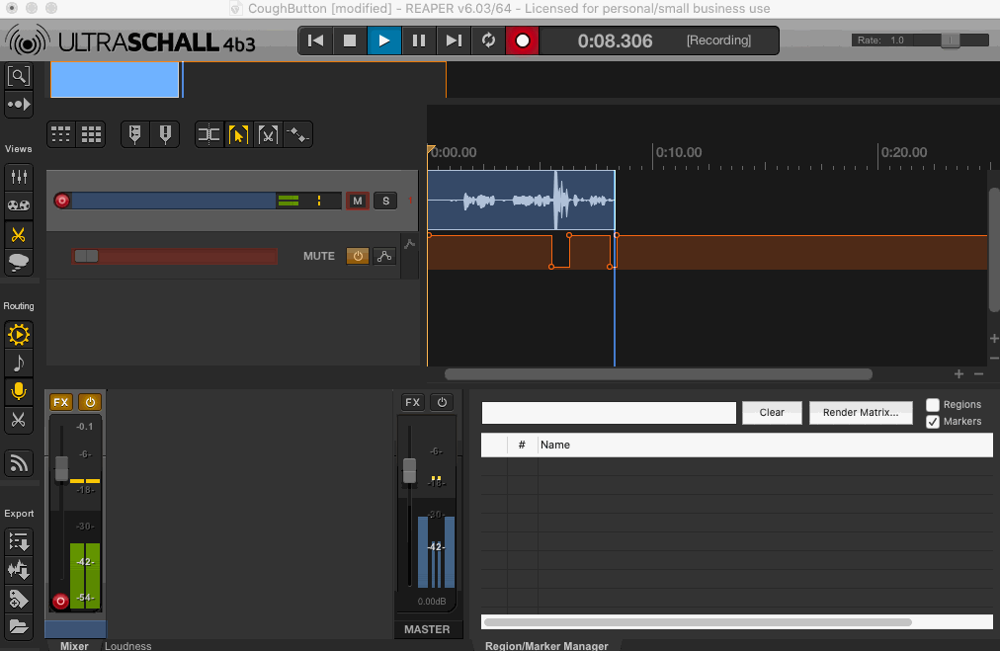
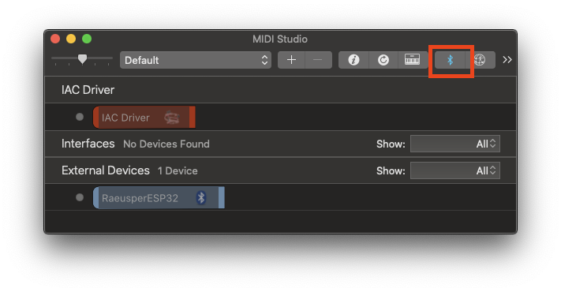
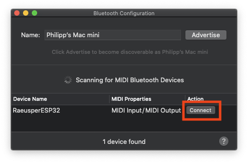

# RäusperESP32
Ultraschall/Reaper Mute/Push-to-talk via ESP32 + Button (using Bluetooth Midi)

## Why?
For podcasting I use the combination of [Reaper](https://www.reaper.fm/) and [Ultraschall](https://ultraschall.fm/) for recording and cutting audio.

While recording, you sometimes have the need to mute yourself (to cough, to drink, etc.).
Other people actually prefer to use push-to-talk to be muted by default.

Ultraschall supports this workflow already with a cough-track that does that for you.

Now we only need a fancy button to use for muting.

## What?

## Required tools & materials
* ESP32 microcontroller
* Whatever you want to use as "mute-button":  Foot pedal, switch, button, ...
* Micro-USB cable (for flashing)
* Power
  * Any kind of USB Power (for running);
  * Alternatively: An ESP32 that runs on batteries.
* For assembly: Soldering iron (only **two** cables have to be soldered)

## Hardware Assembly:
* Connect your switch to GND and pin 18

Using a different pin: If you use a different PIN you have to change it PIN in the sourcecode. Check if your ESP32 provides a pull-up resistor for that PIN. Also: Check if the PIN is not used by anything else of the ESP32 and get the ID of that Pin.

## Software
1. Download/clone the software from https://github.com/derphilipp/RaeusperESP32/
2. Open the project (recommendation: [Visual Studio Code](https://code.visualstudio.com/))
3. Change all configuration items you want to in `./src/main.cpp`:
    * Do you want push-to-talk instead of mute? Change `PUSH_TO_TALK` to `true`
    * Do you want a different bluetooth name? Change `DEVICE_NAME`
    * Do you want to mute/push-to-talk a different track than 1? Change `CHANNEL_NR`
    * Do you use a different PIN? Change `BUTTON_PIN`
4. Connect the ESP32 to your computer using the Micro-USB cable
5. Build & Flash the device using platformio

## Usage
* Connect ESP32 to any power source (via MicroUSB cable, or your battery)
* Use bluetooth to connect your new mute-button

### Usage macOS
* Open "Audio Midi Setup"
* Window -> Show MIDI Studio
* Click the Bluetooth Symbol

* A list of Bluetooth MIDI devices shows up. Select your device an click "Connect"

Don't forget to enable the MIDI Devices in Reaper and allow CC signals to be received. Enjoy!